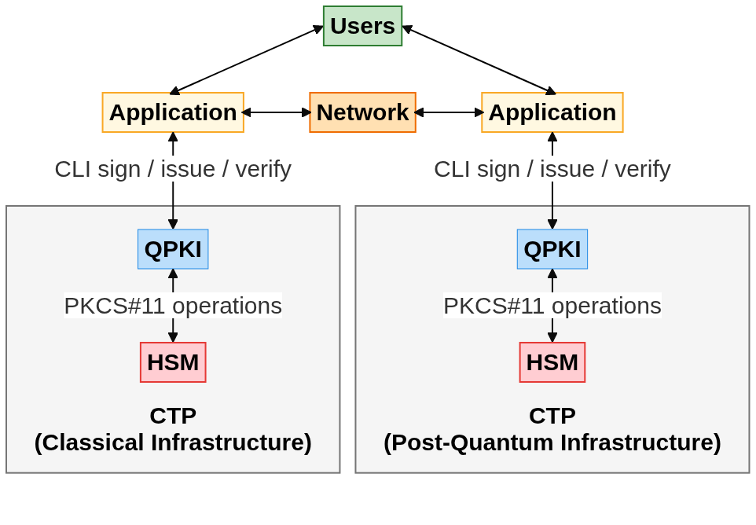
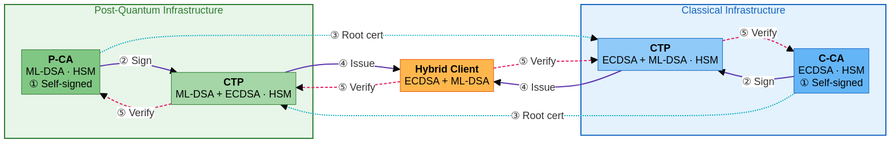
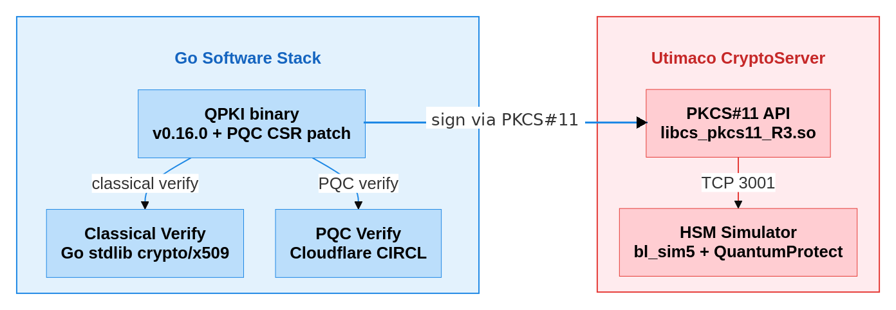
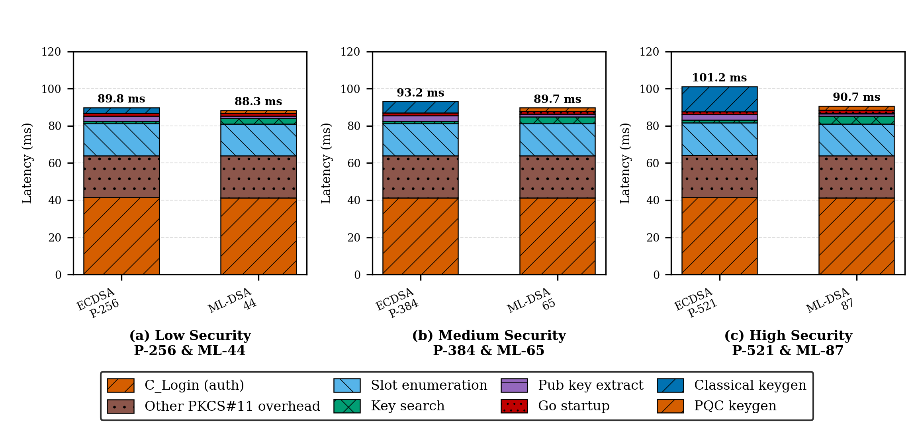
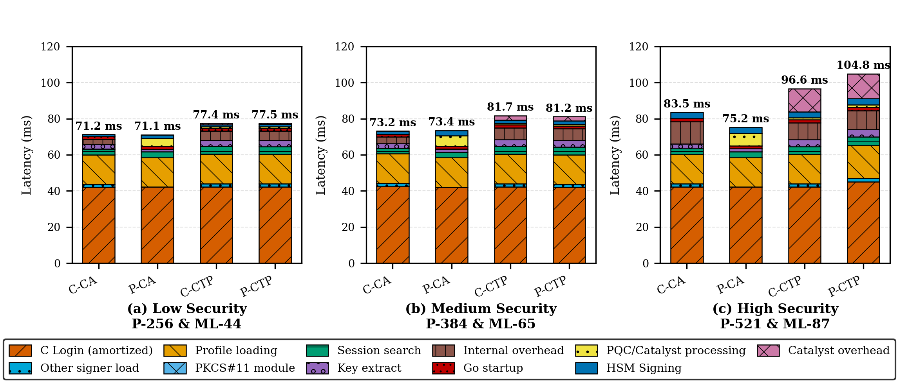
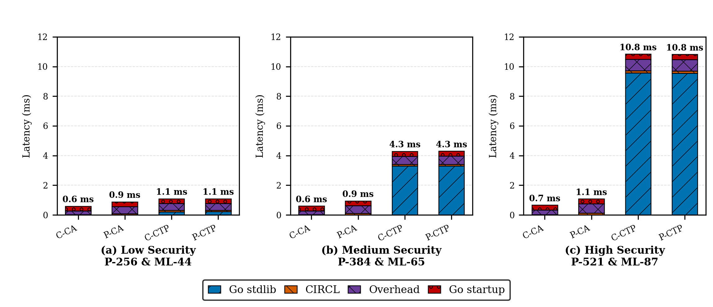
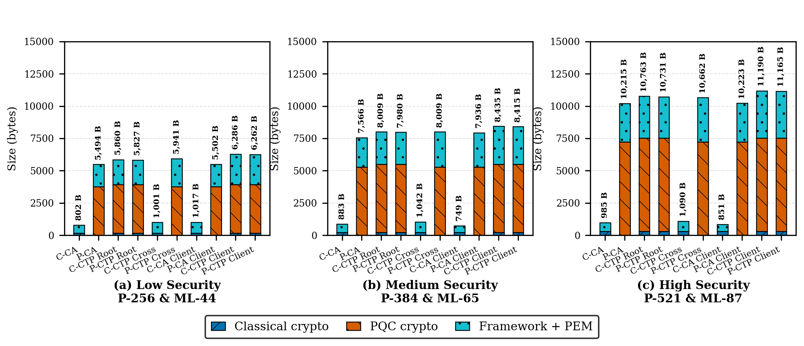

# Bridging the PQ-PKI Migration Chasm via HSM-Based Cryptographic Translation Proxy

This repository provides supplementary material, code, artifacts, and **detailed tabular results**. We also provide high-level organization view of our codebase. 

## Preliminary

We cannot include Utimaco simulator binaries needed to run our CTP in this directory as they are proprietary. However, they can be downloaded after creating an account with Utimaco [here](https://support.hsm.utimaco.com/home). Further extraction instructions are provided in **Reproducing the Utimaco HSM**.

Prior to our work, QPKI was available as open-source, however, it has since moved to closed-source where only precompiled binaries remain available for download.

## Architecture

High level overview of CTP with network, users, applications, HSM, and cryptographic domain context.



Full Dual CTP architecture with CTPs in both the classical and post-quantum infrastructure domains.



HSM architecture used to perform cryptographic operations and communicate with the Utimaco HSM.



## Meta-Security Levels

We define three *meta-security* levels $S_l = (\mathcal{M}(A_{classical}, l), \mathcal{M}(A_{PQC}, l))$ for $l \in \{\text{Low}, \text{Medium}, \text{High}\}$. Each level pairs a classical and a PQC algorithm. The lab specifically encodes these as `l1`/`l3`/`l5`.

| Level | C-CA | P-CA | CTP CA | C-CA Client | P-CA Client | **CTP Client** |
|-------|------|------|--------|-------------|-------------|---------------|
| **Low** | P-256 (L1) | ML-44 (L2) | P-256 + ML-44 | P-256 | ML-44 | P-256 + ML-44 |
| **Medium** | P-384 (L3) | ML-65 (L3) | P-384 + ML-65 | P-256 | ML-65 | P-384 + ML-65 |
| **High** | P-521 (L5) | ML-87 (L5) | P-521 + ML-87 | P-256 | ML-87 | P-521 + ML-87 |

All latency results below are arithmetic means after 100 warm-up samples; the instrumented tables report 1,000 full samples per case.

## Results

### Key Generation

The key generation latency is the summation of the times in milliseconds taken by the firmware-side key generation, PKCS#11 session authentication, PKCS#11 and middleware calls not isolated by Utimaco TRACE logging, slot enumeration, post-generation key lookup, public key extraction, and Go runtime startup. We observe that C Login, slot enumeration, and other PKCS#11 related overhead dominate latency costs across low, medium, and high meta-security levels, 41.4ms, 17.3ms, and 22.6ms respectively. Additionally, core HSM key generation scales with key size across meta-security levels for both ECDSA, (2.9ms, 6.1ms, and 13.6ms) and ML-DSA (1.6ms, 1.8ms, and 2.2ms) variants with classical key generation experiencing increased latency compared to PQC. Other operations represent a small fraction of total latency. By taking mean average across meta-security levels, key search in the classical case (1.3ms) is faster than in the PQC case (3.5ms), while public key extraction is slightly slower in the classical case (2.9ms) compared to PQC (1.5ms). Overall, results indicate a total latency increase for both classical (+3.7% and +8.6%) and PQC (+1.6% and +1.1%) key generation between meta-security levels, and a reduction in key generation latency for PQC within each meta-security level compared to classical (-1.7\%, -3.7\%, -10.3\%).



| Level | Mode | Algorithm | Firmware | C_Login | PKCS#11 OH | Slot enum | Key search | Pub extract | Go start | Total |
|-------|------|-----------|----------|---------|-----------|-----------|------------|-------------|-----------|-------|
| Low    | HSM | ECDSA P-256 | 2.916 ± 0.483  | 41.393 ± 1.404 | 22.600 | 17.217 | 1.299 | 2.831 | 1.560 ± 0.169 | **89.816 ± 3.003**  |
| Low    | HSM | ML-DSA-44   | 1.558 ± 0.587  | 41.318 ± 1.492 | 22.637 | 17.133 | 2.846 | 1.264 | 1.572 ± 0.172 | **88.328 ± 4.115**  |
| Medium | HSM | ECDSA P-384 | 6.125 ± 0.667  | 41.386 ± 1.431 | 22.553 | 17.340 | 1.323 | 2.920 | 1.542 ± 0.149 | **93.189 ± 3.031**  |
| Medium | HSM | ML-DSA-65   | 1.847 ± 0.529  | 41.308 ± 1.451 | 22.666 | 17.252 | 3.609 | 1.457 | 1.589 ± 0.176 | **89.728 ± 4.412**  |
| High   | HSM | ECDSA P-521 | 13.551 ± 0.927 | 41.472 ± 1.887 | 22.695 | 17.571 | 1.360 | 2.971 | 1.549 ± 0.164 | **101.169 ± 4.073** |
| High   | HSM | ML-DSA-87   | 2.235 ± 0.440  | 41.293 ± 1.701 | 22.545 | 17.219 | 4.154 | 1.651 | 1.581 ± 0.161 | **90.679 ± 4.356**  |


### Issuance

The key issuance latency is the summation of amortized PKCS\#11 session authentication, signer loading after the directly timed PKCS\#11 components, profile parsing, module loading, session/key search, public-key extraction, residual issuance overhead, Go startup, software-side PQC or catalyst processing, the HSM signing operation, and catalyst signing overhead. We observe that C Login (42.4ms) and profile loading (16.5ms) dominate issuance latency with near-constant consistency across algorithms and meta-security levels. Also, the P-CA case has a large PQC/catalyst processing overhead as compared to all other entities across meta-security levels. Lastly, catalyst overhead increases noticeably across meta-security levels for classical side CTP (C-CTP) (0.7ms, 2.3ms, and 12.8ms) and PQC side CTP (P-CTP) (0.7ms, 2.3ms, 13.6ms). This is expected since they are the only entities that include hybrid certificates. Overall, the total latency increases across all meta-security levels. Additionally, an entity-related trend in low and medium meta-security levels exist, where $\text{P-CA} \approx \text{C-CA} < \text{C-CTP} \approx \text{P-CTP}$. However, in the high meta-security level, $\text{P-CA} < \text{C-CA} < \text{C-CTP} < \text{P-CTP}$, where differences are more apparent. Importantly, because both CTPs produce catalyst hybrid certificates they have similar latency breakdown results. Lastly, we observe that CTP has comparable total performance to pure CA counterparts for low and medium security levels, within 6.4ms and 8.5ms respectively while enabling interoperability.



| Level | Cert | C Login | Other Sign | HSM Sign | Cat OH | Hyb Proc | Prof Load | P11 Mod | Sess Srch | Key Extr | Int Ovhd | Go Start | Total |
|-------|------|---------|-----------|----------|--------|----------|-----------|---------|-----------|----------|----------|----------|-------|
| Low    | C-CA  | 42.10 ± 1.92 | 1.71 | 0.95 ± 0.19 | —     | —           | 16.27 ± 0.98 | 0.02 | 3.12 | 2.54 | 2.92  | 1.53 ± 0.17 | **71.17 ± 2.76**   |
| Low    | P-CA  | 42.18 ± 3.27 | —    | 2.10 ± 0.79 | —     | 4.35 ± 0.79 | 16.34 ± 1.00 | 0.01 | 3.21 | 1.39 | —     | 1.55 ± 0.17 | **71.13 ± 5.66**   |
| Low    | C-CTP | 42.28 ± 2.12 | 1.73 | 1.22 ± 0.61 | 0.73  | 0.72 ± 0.08 | 16.36 ± 1.09 | 0.01 | 4.28 | 3.36 | 5.16  | 1.57 ± 0.19 | **77.43 ± 3.42**   |
| Low    | P-CTP | 42.20 ± 2.52 | 1.76 | 1.26 ± 0.69 | 0.74  | 0.72 ± 0.07 | 16.31 ± 1.02 | 0.01 | 4.28 | 3.41 | 5.29  | 1.56 ± 0.18 | **77.52 ± 4.74**   |
| Medium | C-CA  | 42.43 ± 2.35 | 1.73 | 1.62 ± 0.25 | —     | —           | 16.41 ± 1.25 | 0.01 | 3.15 | 2.59 | 3.65  | 1.57 ± 0.20 | **73.16 ± 3.42**   |
| Medium | P-CA  | 42.13 ± 1.97 | —    | 2.84 ± 1.20 | —     | 5.83 ± 1.21 | 16.34 ± 1.11 | 0.01 | 3.14 | 1.62 | —     | 1.56 ± 0.17 | **73.45 ± 2.99**   |
| Medium | C-CTP | 42.28 ± 3.29 | 1.72 | 1.91 ± 0.80 | 2.31  | 0.90 ± 0.09 | 16.34 ± 1.17 | 0.01 | 4.41 | 3.65 | 6.54  | 1.59 ± 0.20 | **81.68 ± 4.24**   |
| Medium | P-CTP | 41.99 ± 1.72 | 1.71 | 1.91 ± 0.78 | 2.31  | 0.89 ± 0.09 | 16.28 ± 0.97 | 0.01 | 4.34 | 3.64 | 6.49  | 1.60 ± 0.19 | **81.17 ± 2.91**   |
| High   | C-CA  | 42.20 ± 2.21 | 1.73 | 3.35 ± 0.39 | —     | —           | 16.31 ± 1.07 | 0.01 | 3.16 | 2.63 | 12.43 | 1.70 ± 0.18 | **83.52 ± 3.37**   |
| High   | P-CA  | 42.20 ± 2.15 | —    | 3.32 ± 1.19 | —     | 6.87 ± 1.20 | 16.27 ± 0.98 | 0.01 | 3.15 | 1.83 | —     | 1.59 ± 0.17 | **75.23 ± 2.90**   |
| High   | C-CTP | 42.21 ± 2.58 | 1.72 | 3.28 ± 0.73 | 12.78 | 1.13 ± 0.11 | 16.23 ± 1.08 | 0.01 | 4.37 | 3.84 | 9.39  | 1.64 ± 0.19 | **96.61 ± 3.84**   |
| High   | P-CTP | 45.09 ± 7.28 | 1.97 | 3.60 ± 1.00 | 13.64 | 1.23 ± 0.23 | 18.08 ± 3.39 | 0.01 | 4.88 | 4.13 | 10.34 | 1.87 ± 0.40 | **104.84 ± 14.14** |

### Verification

We measure software-based verification latency, shown in the figure and table below, where all operations are performed using the Go standard library (classical ECDSA signatures) and the Cloudflare CIRCL library (PQC ML-DSA signatures), without HSM involvement. HSM is not present since verification is a non-sensitive public operation that does not require physical protection. The total verification latency is composed of the directly timed Go and CIRCL verification library paths, the verification overhead, and the remaining Go startup. Our verification timing results indicate that there is near constant total latency for C-CA (0.6ms, 0.6ms, and 0.7ms) and P-CA (0.9ms, 0.9ms, and 1.1ms) across low, medium, and high meta-security levels. Also, there is a large and identical increasing latency across meta-security levels for CTPs (1.1ms, 4.3ms, and 10.8ms). This increase in latency is driven by the Go standard library's verification of classical signatures compared to CIRCL library verification of PQC signatures. Lastly, we find CTP is comparable with CA counterparts, within 0.5ms, for the low meta-security level while enabling interoperability.



| Level | Cert | Go Stdlib | CIRCL | Overhead | Go Startup | Total |
|-------|------|-----------|-------|----------|-----------|-------|
| Low    | C-CA  | 0.020 ± 0.008 | —             | 0.252 | 0.321 ± 0.097 | **0.593 ± 0.117**  |
| Low    | P-CA  | —             | 0.084 ± 0.015 | 0.478 | 0.321 ± 0.094 | **0.883 ± 0.123**  |
| Low    | C-CTP | 0.219 ± 0.028 | 0.096 ± 0.016 | 0.459 | 0.318 ± 0.097 | **1.092 ± 0.156**  |
| Low    | P-CTP | 0.220 ± 0.030 | 0.097 ± 0.018 | 0.455 | 0.317 ± 0.094 | **1.090 ± 0.144**  |
| Medium | C-CA  | 0.021 ± 0.008 | —             | 0.252 | 0.328 ± 0.095 | **0.601 ± 0.110**  |
| Medium | P-CA  | —             | 0.099 ± 0.020 | 0.538 | 0.311 ± 0.097 | **0.948 ± 0.130**  |
| Medium | C-CTP | 3.292 ± 0.396 | 0.115 ± 0.020 | 0.553 | 0.331 ± 0.112 | **4.292 ± 0.444**  |
| Medium | P-CTP | 3.298 ± 0.381 | 0.116 ± 0.021 | 0.555 | 0.333 ± 0.095 | **4.302 ± 0.435**  |
| High   | C-CA  | 0.021 ± 0.009 | —             | 0.315 | 0.326 ± 0.095 | **0.662 ± 0.114**  |
| High   | P-CA  | —             | 0.120 ± 0.021 | 0.635 | 0.322 ± 0.096 | **1.078 ± 0.127**  |
| High   | C-CTP | 9.571 ± 0.540 | 0.152 ± 0.028 | 0.767 | 0.349 ± 0.113 | **10.839 ± 0.579** |
| High   | P-CTP | 9.543 ± 0.546 | 0.152 ± 0.028 | 0.770 | 0.352 ± 0.105 | **10.817 ± 0.580** |

### Certificate Sizes

The certificate sizes across meta-security levels for all certificate types, are shown in figure below. We obtained a certificate's total size and distinguish between its fixed signature sizes and its variable framework and Privacy Enhanced Mail (PEM) sizes. As expected, we observe an increase in certificate size across meta-security levels. We also observe that C-CA, C-CTP-Cross, and C-CA Client are consistently smaller compared to all other certificates as they use pure classical cryptography with ECDSA. Additionally, for all other cases we observe large size increase across all meta-security levels where ML-DSA is used. However, the largest certificates are consistently the C-CTP Client, P-CTP Client, C-CTP Root, and P-CTP Root as they are hybrid certificates that include both classical and PQC signatures. 



| Level | Cert Tag | Classical | PQC Crypto | Framework/PEM | Total Size |
|-------|----------|-----------|------------|---------------|------------|
| Low | C-CA | 163 B | — | 635 B | **798 B** |
| Low | P-CA | — | 3,754 B | 1,740 B | **5,494 B** |
| Low | C-CTP Root | 163 B | 3,754 B | 1,943 B | **5,860 B** |
| Low | P-CTP Root | 163 B | 3,754 B | 1,906 B | **5,823 B** |
| Low | C-CTP Cross | 163 B | — | 834 B | **997 B** |
| Low | P-CTP Cross | — | 3,754 B | 2,187 B | **5,941 B** |
| Low | C-CA Client | 163 B | — | 858 B | **1,021 B** |
| Low | P-CA Client | — | 3,754 B | 1,748 B | **5,502 B** |
| Low | C-CTP Client | 163 B | 3,754 B | 2,365 B | **6,282 B** |
| Low | P-CTP Client | 163 B | 3,754 B | 2,341 B | **6,258 B** |
| Medium | C-CA | 224 B | — | 659 B | **883 B** |
| Medium | P-CA | — | 5,283 B | 2,283 B | **7,566 B** |
| Medium | C-CTP Root | 224 B | 5,283 B | 2,502 B | **8,009 B** |
| Medium | P-CTP Root | 224 B | 5,283 B | 2,473 B | **7,980 B** |
| Medium | C-CTP Cross | 224 B | — | 858 B | **1,082 B** |
| Medium | P-CTP Cross | — | 5,283 B | 2,726 B | **8,009 B** |
| Medium | C-CA Client | 224 B | — | 525 B | **749 B** |
| Medium | P-CA Client | — | 5,283 B | 2,653 B | **7,936 B** |
| Medium | C-CTP Client | 224 B | 5,283 B | 2,932 B | **8,439 B** |
| Medium | P-CTP Client | 224 B | 5,283 B | 2,908 B | **8,415 B** |
| High | C-CA | 297 B | — | 688 B | **985 B** |
| High | P-CA | — | 7,241 B | 2,974 B | **10,215 B** |
| High | C-CTP Root | 297 B | 7,241 B | 3,225 B | **10,763 B** |
| High | P-CTP Root | 297 B | 7,241 B | 3,193 B | **10,731 B** |
| High | C-CTP Cross | 297 B | — | 883 B | **1,180 B** |
| High | P-CTP Cross | — | 7,241 B | 3,421 B | **10,662 B** |
| High | C-CA Client | 297 B | — | 554 B | **851 B** |
| High | P-CA Client | — | 7,241 B | 2,982 B | **10,223 B** |
| High | C-CTP Client | 297 B | 7,241 B | 3,652 B | **11,190 B** |
| High | P-CTP Client | 297 B | 7,241 B | 3,627 B | **11,165 B** |

## Code Organization

```
./
├── run_level.sh               # Deploy a specific meta-security level: ./run_level.sh <l1|l3|l5> up|down
├── extract.sh                 # Rebuild the Utimaco-derived files in hsm/ from the vendor zips
├── docker-compose.yml         # 8 services / 2 profiles (baseline=direct CAs, full=entity CAs + proxies)
├── u.trust-GP-HSM-Simulator_v6.5.0.0.zip           # vendor zip (request from Utimaco) -> extract.sh
├── QuantumProtect-1.5.0.0-Evaluation.zip          # vendor zip (request from Utimaco) -> extract.sh
├── README.md
├── certs/                     # Benchmark CSRs copied in for measurement (bench-*.csr)
├── tables/                    # LaTeX source of the four result tables (tab-*.tex)
├── figures/                   # Regenerated publication figures (fig-*.pdf/png)
├── diagrams/                  # Architecture figures (.mmd / .pdf / .png)
├── entities/                  # PKI entity images (one per entity)
│   ├── classical/             # Dockerfile + entrypoint.sh — C-CA root + cross-sign HP
│   ├── pqc/                   # Dockerfile + entrypoint.sh — P-CA root + cross-sign HP
│   └── proxy/                 # Dockerfile + entrypoint.sh — parametrized HP (PROXY_NAME/CSR_ALGO)
├── hsm/
│   ├── sim/                   # Simulator image: Dockerfile + entrypoint.sh (bl_sim5, cs_sim.ini, devices@extract.sh)
│   ├── init/                  # One-shot token initializer (SO PIN / User PIN)
│   ├── profiles/              # Certificate profiles (per level, see below)
│   ├── qpki, qpki_timed       # QPKI binary (v0.16.0, patched) + instrumented build
│   ├── cs_pkcs11_R3.cfg       # PKCS#11 config (ctp-sim:3001, slot 0; Logging flag)
│   ├── utimaco-simulator.yaml # QPKI HSM config
│   └── (+) generated by extract.sh: libcs_pkcs11_R3.so, libcxi.so, csadm, cxitool,
│                  p11tool2, keys/, sim/bl_sim5, sim/cs_sim.ini, sim/devices/
└── measure/                   # Benchmark collection + chart generation
    ├── charts.py              # Regenerate figures/ + tables/ from raw data
    ├── parse_cs_pkcs11_log.py # Parse cs_pkcs11_R3.log TRACE log -> per-call durations
    ├── collect_all.sh         # Instrumented issue/verify timing for all levels (1,000 samples/case)
    ├── collect_keygen_trace.sh# TRACE-backed HSM keygen micro-timing (C_GenerateKeyPair + C_Login)
    └── collect_sizes.sh       # Certificate sizes per level (results/lX_size-*.txt)
```

## Reproducing the Utimaco HSM

The Utimaco binaries are proprietary and not committed to the repository. `extract.sh` rebuilds them from two vendor packages that must be requested from Utimaco and placed in this directory (the repository root):

- `u.trust-GP-HSM-Simulator_v6.5.0.0.zip` — GP HSM Simulator (bootloader, PKCS\#11 client library, admin tools, admin keys)
- `QuantumProtect-1.5.0.0-Evaluation.zip` — QuantumProtect PQC firmware (`cs_sim.ini`, `devices/`)

Run from this directory:

```bash
./extract.sh
```

This populates `hsm/` in place with the Utimaco-derived files: `hsm/sim/` (bl_sim5, cs_sim.ini, devices), `libcs_pkcs11_R3.so`, `libcxi.so`, `csadm`, `cxitool`, `p11tool2`, and `hsm/keys/`. It verifies both input zips against hardcoded checksums (aborting with the offending filename) and re-checks every extracted file, so only the validated v6.5.0.0 bootloader + v1.5.0.0 firmware combination is accepted.

## Running & Measuring

```bash
./run_level.sh l3 up                      # deploy Medium (l3), waits for READY
python3 measure/charts.py                 # regenerate figures + tables from raw data
./run_level.sh l3 down                    # teardown + wipe HSM state (-v)
docker compose --profile full down -v     # manual full teardown
```

Each level change must be preceded by a full teardown (`down -v`) to clear the Utimaco simulator's persistent key store. Benchmark collection (`measure/collect_*.sh`) requires the instrumented `qpki_timed` binary deployed to each container, and `QPKI_DEBUG=1` set inside the containers (via `sh -c`, since `docker exec` does not forward host env).
